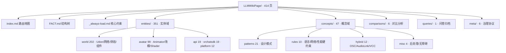

# 🧠 VRChat-Agent-Open-Memory-Library

> **VRChat 专属 AI Agent 开放记忆库** — 一个自包含、机器可解析的 VRChat 多领域知识包，专为 RAG 与 AI Agent 设计。

[](LICENSE)
[](CHANGELOG.md)
[]()
[]()
[]()
[]()
[]()

---

## 📑 目录 (Table of Contents)

- [⚡ 快速开始](#快速开始-quick-start)
- [📖 项目简介](#项目简介-introduction)
- [✨ 核心特性](#核心特性-features)
- [📊 内容地图](#内容地图-content-map)
- [🚀 使用指南](#使用指南-usage)
- [🚧 工程红线速查](#工程红线速查-constraints)
- [📐 核心概念](#核心概念-concepts)
- [🤝 贡献指南](#贡献指南-contributing)
- [📜 更新日志](#更新日志-changelog)
- [📄 许可证](#许可证-license)

---

## ⚡ 快速开始 (Quick Start)

**只需要三步：**

```bash
# 1️⃣ 克隆仓库
git clone https://github.com/RhineLab-magellan/VRChat-Agent-Open-Memory-Library.git
cd VRChat-Agent-Open-Memory-Library

# 2️⃣ 指定知识根（414 个 Markdown 知识页）
#    memoryV5.0.0/LLMWikiExample/LLMWikiPage/
```

**把它当成任何 Markdown 知识源使用即可**——每页自带 YAML 元数据，可读、可切块、可向量化：

```python
# 3️⃣ 示例：加载到 LangChain（示意，具体切块/嵌入按你的管线调整）
from langchain.document_loaders import TextLoader

# 知识根：LLMWikiPage/ 共 414 页；index.md 是路由入口（整目录请用 DirectoryLoader）
loader = TextLoader("memoryV5.0.0/LLMWikiExample/LLMWikiPage/index.md")
docs = loader.load()
# ... 接你的 RAG / 向量化 / 检索代码
```

**或者用 Obsidian 直接打开**：`Open folder as Vault` → 选择 `memoryV5.0.0/LLMWikiExample/LLMWikiPage/`，图谱与内链立即可用。

### 术语速查（首次见面，一句话解释）

| 术语 | 是什么 |
|---|---|
| **LLMWikiPage** | 知识包内部的目录体系：`entities/`（实体域）·`concepts/`（概念域）·`comparisons/`·`queries/`·`meta/`，配合顶层 `index.md`（路由地图）/ `FACT.md`（结构树）/ `_always-load.md`（核心约束）。 |
| **frontmatter** | 每页开头 `---` 包裹的 YAML 元数据块（标题/类型/标签/可信度等），机器可直接解析。 |
| **[[wikilink]]** | 知识页之间的双向链接（Obsidian 语法），用于图谱浏览与检索。 |
| **confidence** | 每页的可信度分级：`high`（官方验证）/ `medium`（多源交叉）/ `low`（推断，必须带来源与理由）。 |

---

## 📖 项目简介 (Introduction)

VRChat 创作者的知识高度碎片化——官方文档、SDK 源码、开源项目和社区经验散落在各处。本项目把这些问题沉淀为**结构化的 Markdown 知识库**：一个自包含、纯知识、可审计的知识发布包，让 **AI Agent 与人类创作者共用同一份权威知识**。

- **给 AI Agent**：直接作为 RAG / 向量化的知识源，`tags`/`type`/`confidence` 元数据让检索更精准，`[[wikilink]]` 让跨页知识可追溯。
- **给人类创作者**：作为 Obsidian 图谱打开的 Vault，从 `index.md` 路由到任意领域，从链接图看清知识拓扑。

> 这是一个「**对外发布的知识包**」：纯知识内容，不携带任何个人路径与私人治理痕迹。

---

## ✨ 核心特性 (Features)

- 📚 **414 个知识页**，覆盖 World、Avatar、API、Platform、VRChatSDK、Rules、Patterns、Hybrid 等 10+ 领域（约 3.90 MB）。
- 🤖 **100% YAML frontmatter** — 任意页面可被机器解析，可直接喂给 RAG / 向量化管线。
- 🔗 **0 死链** — 全库使用 `[[wikilink]]` + 相对链接 + `http(s)://` URL 互连，图谱全库可解析。
- 🎯 **可信度分级** — 每页标注 `high / medium / low`，区分官方事实、社区共识与推断。
- ✅ **发布就绪四指标（C1–C4）** — 自动化检查可复现：自包含 / 置信度 / Fact Index / 标签。
- 🧩 **自包含** — 仅依赖库内链接与公开 URL，无硬编码本地路径，可整体迁移。

> 📋 **质量佐证**：发布就绪的自动化检查与独立审查报告见仓库 [`reports/`](reports/)（[V5 独立审查报告](reports/V5独立审查报告-2026-08-20.md) · [发布检查报告](reports/发布检查报告-2026-08-20.md)），报告不随发布包分发。

---

## 📊 内容地图 (Content Map)

知识根 `LLMWikiPage/` 的物理目录即领域：



| 域 | 页数 | 内容 |
|---|---|---|
| `entities/world/` | 202 | Udon 编程、网络同步、Persistence、Scene Components、示例、光照烘焙、工具 |
| `entities/avatar/` | 99 | Animator、改模优化、Shader（lilToon / Poiyomi / ORL / Filamented / UnlitWF）、工具链 |
| `entities/api/` | 19 | Networking / Persistence / Player / 动画 / 音频 / UI API 参考 |
| `entities/vrchatsdk/` | 19 | VRChat HTTP API、WebSocket、数据模型 |
| `entities/platform/` | 12 | Quest / Android、跨平台、Unity 工具链 |
| `concepts/patterns/` | 21 | 同步 / 状态机 / 消息总线等设计模式 |
| `concepts/rules/` | 10 | UdonSharp 语言限制 / 网络 / 性能 / VM 硬约束 |
| `concepts/hybrid/` | 12 | OSC、AudioLink、VCC/ALCOM、桥接 |
| `concepts/misc/` | 4 | 后处理、无障碍等 |
| `comparisons/` | 6 | Poiyomi vs lilToon、FIL-ORL-Poiyomi Pro 等对比 |
| `meta/` + 顶层 3 | 9 | 治理协议 + FACT / index / _always-load |

> 页数统计口径与各域内容随版本演进，详见 [CHANGELOG.md](CHANGELOG.md)。

---

## 🚀 使用指南 (Usage)

### 场景 1：RAG / 向量化（Ollama / LangChain / 任意切块管线）

把 `memoryV5.0.0/LLMWikiExample/LLMWikiPage/` 作为知识根喂给切块管线：

- 每页 frontmatter 提供 `tags` / `type` / `confidence`，可作为**检索标签**与**过滤条件**；
- 链接为 `[[相对wikilink]]` 或 URL，可平滑拆分为跨页引用；
- 建议按域（`entities/...`、`concepts/...`）分片加载，控制上下文规模。

### 场景 2：AI Agent 代码工程（Cursor / Claude Code / Copilot 等）

```yaml
# AGENTS.md / CLAUDE.md / .cursorrules
memory_root: memoryV5.0.0/LLMWikiExample/LLMWikiPage/
boot_files:
  - memoryV5.0.0/LLMWikiExample/LLMWikiPage/_always-load.md   # 跨域核心约束，每会话必载
  - memoryV5.0.0/LLMWikiExample/LLMWikiPage/FACT.md           # 知识库结构树 + 长期事实
```

> 一致建议给 Agent 的通用策略：先附加 `_always-load.md`（核心约束）→ 再附加 `FACT.md`（结构）→ 按需用 `index.md` 路由到的具体域文件。上下文敏感时不要一次性载入全部 414 页。

### 场景 3：Obsidian / 直接阅读（人类）

- **Obsidian**：把 `memoryV5.0.0/LLMWikiExample/LLMWikiPage/` 作为 Vault 打开，从 `index.md`（路由地图）开始，内链与图谱立即可用。
- **直接阅读**：从 `index.md` 或 `FACT.md` 进入，按目录浏览。

### 快速路由表

> 以下路径均相对 `LLMWikiPage/` 根目录。

| 我想做什么 | 从哪里开始 |
|---|---|
| 学习 Udon 编程 | `entities/world/udon/index.md` → `entities/world/udon/udonsharp/` |
| 解决网络同步问题 | `concepts/rules/networking-rules.md` → `concepts/patterns/manual-sync-state.md` |
| 优化 World 性能 | `concepts/rules/performance-rules.md` → `entities/world/performance-guide.md` |
| Avatar 改模入门 | `entities/avatar/modular-avatar.md` → `entities/avatar/teaching-methodology.md` |
| 选择 Avatar Shader | `entities/avatar/shader/index.md`（lilToon / Poiyomi / ORL / Filamented / UnlitWF 对比矩阵）|
| Poiyomi shader 细节 | `entities/avatar/shader/poiyomi/index.md` + `comparisons/poiyomi-pro-vs-toon.md` |
| 审查 UdonSharp 代码 | `concepts/rules/udonsharp-language-limits.md` → `concepts/rules/udonsharp-deep-pitfalls.md` |
| 开发外部应用 | `entities/vrchatsdk/index.md` |
| Quest 适配 | `entities/platform/android-development.md` |
| 管理 VCC / ALCOM | `concepts/hybrid/vcc.md` → `concepts/hybrid/alcom.md` |
| 查阅 API 签名 | `entities/api/` 目录 grep 关键词 |
| OSC 协议 | `concepts/hybrid/osc-protocol.md` |

---

## 🚧 工程红线速查 (Constraints)

> World / Avatar 开发**绝对红线**，完整规范见库内 `_always-load.md` 与 `concepts/rules/`：

| # | 约束 | 后果 |
|---|---|---|
| 1 | **只支持 BRP 渲染管线**（禁止 URP / HDRP） | 项目完全无法工作 |
| 2 | Editor 脚本必须放在 `Editor` 文件夹内 | 跨平台构建失败 |
| 3 | Unity 版本锁定 2022.3.22f1 LTS（SDK 3.5.0+） | 版本不兼容 |
| 4 | 禁止 List / Dictionary / LINQ / lambda | Udon VM 不支持 |
| 5 | 禁止 async/await / try-catch / coroutine | Udon VM 不支持 |
| 6 | 非 Owner 禁止写入 UdonSynced 变量 | 同步数据被覆盖 |
| 7 | Manual Sync 必须调 `RequestSerialization()` | 数据永不发送 |
| 8 | `Update` 中禁止 `GetComponent` / `Find` | 严重性能问题 |
| 9 | 同步 String / DisplayName 需特殊处理 | 带宽浪费 |
| 10 | Enum 比较必须 cast 到 int | 装箱导致 GC |

---

## 📐 核心概念 (Concepts)

本库的机器可读性建立在三个规范之上（完整规范见 `meta/kb-protocol.md`）：

### 1. YAML frontmatter（100% 覆盖）

每页开头的元数据块，直接服务于 RAG 过滤与检索：

```yaml
---
title: 文档标题
type: entity | concept | comparison | query | summary
category: 域
knowledge_level: applied | theoretical | reference
status: active | draft | deprecated
tags: [tag1, tag2]
aliases: [别名1]
related: ["[[关联页面]]"]
source: 知识来源（URL / 文档名）
source_type: official | community | inference
confidence: high | medium | low
---
```

### 2. 可信度分级（confidence）

| 级别 | 含义 | 占比参考 |
|---|---|---|
| `high` | 官方文档 / 官方源码 / 直接实验验证 | ~49% |
| `medium` | 多源交叉一致 / 高质量社区结论 | ~50% |
| `low` | 社区经验 / 推断，**必须带来源与理由** | ~1%（诚实标注）|

### 3. 链接规范

- `[[wikilink]]`：知识页间双向跳转（Obsidian 兼容）；
- 相对 Markdown 链接：指向库内文件；
- `http(s)://` URL：外部权威来源；
- 严禁硬编码本地路径（示例路径一律参数化）。

---

## 🤝 贡献指南 (Contributing)

本库为 **AI Agent 优先 + 人类创作者共用** 的开源技术知识体系。贡献流程：

1. 在 `Training data/` 打包上传 **原始知识文件**（官方文档 / 笔记 / QA / 工程资料）；
2. 附上 **可信度标注**（high / medium / low，区分事实与推断）；
3. 采用后由 **维护者二次审查 + 模型自审**，确定置信度后合入知识库。

> 详细规范（frontmatter 格式、标签体系、链接规范、审查标准）见 **[CONTRIBUTING.md](CONTRIBUTING.md)**。

---

## 📜 更新日志 (Changelog)

最新发布 **v5.0.0** 的三大变化：

- 🏗️ **形态转型** — 以「纯知识发布包」形态发布，知识根收敛为 `LLMWikiExample/LLMWikiPage/`（414 页），目录重构为 `entities / concepts / comparisons / queries / meta`；
- 📚 **新增约 50 页知识** — Unity 场景组件专页（约 45 页）、工具页（udonsharp-linter、unity-mcp 等）、VRCBillboard API 等；
- ✅ **四指标发布就绪** — C1 自包含 / C2 置信度 / C3 Fact Index / C4 标签全门通过，独立审查零违例。

> 📝 完整历史（v1–v4 及逐版本细节）见 **[CHANGELOG.md](CHANGELOG.md)**；每个正式版本也在 **GitHub Releases** 同步发布。

---

## 📄 许可证 (License)

本项目采用 [MIT License](LICENSE) 开源。

**知识共享声明**：本库中的知识来源于 VRChat 官方文档、开源项目文档、社区公开讨论，以及作者的个人实践笔记。所有第三方知识均标注原始来源；如发现任何版权问题，请提交 Issue。
